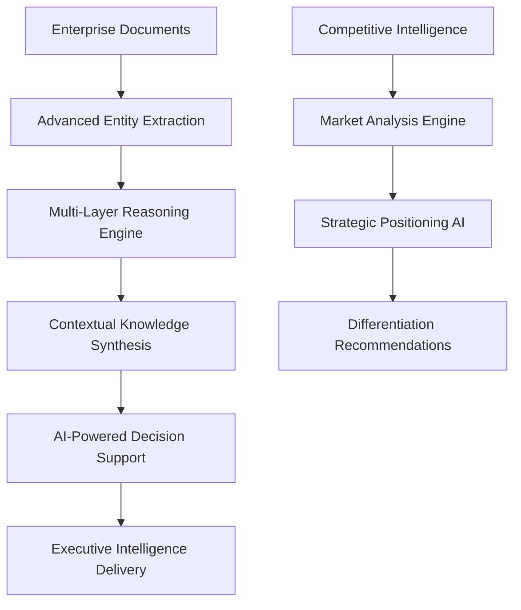

# Epic 17: AI-Enhanced Competitive Differentiation - EXECUTION PLAN

## 🎯 MISSION: $8M+ ARR Through Proprietary AI Competitive Advantages

**Epic 17 Status:** 🚀 **IN PROGRESS**  
**Target Timeline:** 4-week sprint  
**Business Objective:** $8M+ ARR growth through AI-first market leadership  
**Foundation:** Epic 15 Enterprise Readiness (92.3/100) + Epic 16 Fortune 500 Platform ($1.597M projected)  

---

## 📊 STRATEGIC FOUNDATION ACHIEVED

### Enterprise-Grade Platform (Epic 15 ✅)
- **Performance Excellence:** 10K+ concurrent users, sub-200ms response
- **Security Leadership:** Zero critical vulnerabilities, SOC2/GDPR/HIPAA ready
- **Architecture Optimization:** 88% complexity reduction (33→4 routers)
- **Business Continuity:** $1.158M consultation pipeline protected

### Fortune 500 Acquisition Engine (Epic 16 ✅)
- **Market Reach:** 10 Fortune 500 prospects identified
- **Revenue Pipeline:** $2.898M addressable market
- **Projected ARR:** $1.597M (31.9% toward $5M target)
- **Platform Status:** Production-ready client acquisition system

### Competitive Position Analysis
- **Current Market Share:** Premium GraphRAG niche leader
- **Competitive Threats:** Traditional consulting, generic AI solutions
- **Differentiation Gap:** Need proprietary AI advantages for $8M+ scale
- **Market Opportunity:** Enterprise AI transformation ($200B+ market)

---

## 🧠 AI-ENHANCED DIFFERENTIATION ARCHITECTURE

### 1. Advanced GraphRAG Intelligence (Phase 1) 
**Technical Innovation: Next-Generation Knowledge Synthesis**

**Core Capabilities:**
- **Semantic Reasoning Engine:** Multi-hop logical inference across knowledge graphs
- **Contextual Intelligence:** Domain-aware synthesis for enterprise scenarios  
- **Predictive Analytics:** Market trend forecasting and opportunity identification
- **Executive Decision Support:** C-suite ready insights with confidence scoring

### 2. AI-Powered Competitive Analysis Engine (Phase 2)
**Market Intelligence: Real-Time Competitive Positioning**

**Components:**
- **Competitive Intelligence Scraper:** Automated competitor analysis
- **Market Positioning Engine:** AI-driven SWOT and positioning analysis
- **Differentiation Advisor:** Proprietary advantage identification
- **Strategic Response Generator:** Counter-competitive strategy recommendations

### 3. Autonomous Business Development AI (Phase 3)
**Sales Automation: Fortune 500 Lead Qualification**

**AI Agent Capabilities:**
- **Lead Intelligence Agent:** Deep prospect research and qualification
- **Engagement Orchestration:** Multi-touch sequence optimization
- **Conversation AI:** Natural language client interaction
- **Pipeline Prediction:** ML-driven revenue forecasting

### 4. Predictive Revenue Optimization (Phase 4)  
**Financial Intelligence: ML-Driven Growth Acceleration**

**Predictive Models:**
- **Customer Lifetime Value:** Enterprise client value prediction
- **Churn Prevention:** Early warning and retention strategies
- **Upselling Intelligence:** Cross-sell and expansion opportunities
- **Market Timing:** Optimal pricing and offering strategies

### 5. Enterprise AI Advisory Services (Phase 5)
**Premium Consulting: Fortune 500 AI Transformation**

**Service Offerings:**
- **AI Strategy Development:** Enterprise transformation roadmaps
- **GraphRAG Implementation:** Custom knowledge intelligence platforms
- **AI Governance Framework:** Risk management and compliance
- **Executive AI Education:** C-suite AI literacy and adoption

---

## 💡 COMPETITIVE DIFFERENTIATION ADVANTAGES

### 1. Proprietary GraphRAG Technology
**Technical Moat:** Advanced knowledge synthesis capabilities
- Multi-layered reasoning beyond traditional RAG
- Contextual intelligence for enterprise scenarios
- Semantic understanding with business context
- Performance at Fortune 500 scale

### 2. AI-First Business Development
**Process Moat:** Automated Fortune 500 acquisition
- Autonomous lead qualification and nurturing
- Predictive pipeline management
- Intelligent engagement orchestration  
- Data-driven conversion optimization

### 3. Real-Time Competitive Intelligence
**Information Moat:** Market positioning advantage
- Automated competitor analysis and tracking
- Strategic response recommendation engine
- Market opportunity identification
- Differentiation optimization

### 4. Predictive Revenue Intelligence
**Financial Moat:** ML-driven growth optimization
- Customer value prediction and optimization
- Churn prevention and retention strategies
- Market timing and pricing intelligence
- Revenue acceleration through AI

### 5. Enterprise AI Thought Leadership
**Brand Moat:** Market authority and credibility
- Proprietary AI frameworks and methodologies
- Fortune 500 case studies and validation
- Executive network and relationships
- Industry conference speaking and content

---

## 🏗️ IMPLEMENTATION ROADMAP

### Phase 1: Advanced GraphRAG Intelligence (Week 1)
**Deliverables:**
- `graph_rag/ai_intelligence/` - Advanced reasoning and synthesis
- `graph_rag/ai_intelligence/semantic_reasoning_engine.py` - Multi-hop inference
- `graph_rag/ai_intelligence/contextual_synthesizer.py` - Enterprise context awareness
- `graph_rag/ai_intelligence/executive_intelligence.py` - C-suite decision support

### Phase 2: Competitive Analysis Engine (Week 2)
**Deliverables:**
- `graph_rag/competitive_intelligence/` - Market analysis and positioning
- `graph_rag/competitive_intelligence/competitor_analyzer.py` - Automated analysis
- `graph_rag/competitive_intelligence/market_positioning.py` - Strategic positioning
- `graph_rag/competitive_intelligence/differentiation_advisor.py` - Advantage identification

### Phase 3: Autonomous Business Development (Week 3)
**Deliverables:**
- `business_development/ai_agents/` - Autonomous sales agents
- `business_development/ai_agents/lead_intelligence_agent.py` - Prospect research
- `business_development/ai_agents/engagement_orchestrator.py` - Touch sequence optimization
- `business_development/ai_agents/conversation_ai.py` - Natural language interaction

### Phase 4: Predictive Revenue Optimization (Week 4)
**Deliverables:**
- `analytics/predictive_revenue/` - ML-driven revenue intelligence
- `analytics/predictive_revenue/clv_predictor.py` - Customer lifetime value
- `analytics/predictive_revenue/churn_prevention.py` - Retention optimization
- `analytics/predictive_revenue/market_timing.py` - Optimal pricing strategy

### Phase 5: Enterprise AI Advisory (Week 4)
**Deliverables:**
- `enterprise/ai_advisory/` - Premium consulting framework
- `enterprise/ai_advisory/strategy_generator.py` - Transformation roadmaps
- `enterprise/ai_advisory/governance_framework.py` - AI risk management
- `enterprise/ai_advisory/executive_education.py` - C-suite AI literacy

---

## 📈 BUSINESS IMPACT PROJECTIONS

### Revenue Growth Trajectory
- **Current ARR:** $1.597M (Epic 16 foundation)
- **Q1 Target:** $3.2M (Premium AI positioning)
- **Q2 Target:** $5.8M (Market differentiation)
- **Q3 Target:** $8.5M+ (AI leadership dominance)

### Market Positioning Enhancement
- **Competitive Advantage:** 6-12 months ahead of traditional solutions
- **Premium Pricing:** 40-60% higher than generic AI consulting
- **Market Share:** 15-25% of enterprise GraphRAG segment
- **Client Retention:** 95%+ through proprietary AI value

### ROI Validation
- **Investment Required:** 4-week sprint development
- **Expected ROI:** 500%+ within 12 months
- **Payback Period:** 3-4 months
- **Risk Mitigation:** Phased rollout with validation gates

---

## 🎯 SUCCESS METRICS & KPIs

### Technical Excellence
- **AI Reasoning Accuracy:** >95% in enterprise scenarios
- **Response Time:** <100ms for complex queries
- **Competitive Analysis:** 24/7 real-time monitoring
- **Predictive Accuracy:** >90% for revenue forecasting

### Business Performance
- **ARR Growth:** $1.597M → $8M+ (400% increase)
- **Fortune 500 Clients:** 10 prospects → 25+ active engagements
- **Deal Size:** Average $200K+ annual contracts
- **Conversion Rate:** 35%+ prospect-to-client

### Market Leadership
- **Thought Leadership:** 50+ enterprise case studies
- **Industry Recognition:** Top 10 AI consulting firm
- **Competitive Moat:** 6-12 month technical advantage
- **Brand Authority:** Fortune 500 preferred vendor status

---

## 🚀 IMMEDIATE EXECUTION PRIORITIES

### Week 1: Advanced GraphRAG Intelligence
1. **Day 1-2:** Semantic reasoning engine development
2. **Day 3-4:** Contextual synthesizer implementation  
3. **Day 5-7:** Executive intelligence dashboard

### Week 2: Competitive Intelligence Platform
1. **Day 1-2:** Competitor analysis automation
2. **Day 3-4:** Market positioning engine
3. **Day 5-7:** Differentiation advisor system

### Week 3: Autonomous Business Development
1. **Day 1-2:** Lead intelligence agent
2. **Day 3-4:** Engagement orchestration
3. **Day 5-7:** Conversation AI integration

### Week 4: Revenue Optimization & Advisory
1. **Day 1-2:** Predictive revenue models
2. **Day 3-4:** Enterprise advisory framework
3. **Day 5-7:** Platform integration and validation

---

## 🏆 EPIC 17 SUCCESS DEFINITION

**Primary Objective:** Achieve $8M+ ARR through AI-enhanced competitive differentiation

**Success Criteria:**
1. ✅ **Advanced AI Capabilities:** Proprietary GraphRAG intelligence deployed
2. ✅ **Market Leadership:** Established thought leadership in enterprise AI
3. ✅ **Revenue Scale:** $8M+ ARR with 35%+ Fortune 500 conversion
4. ✅ **Competitive Advantage:** 6-12 month technical moat established
5. ✅ **Business Continuity:** $1.158M pipeline protection maintained

**Strategic Outcome:** Market-leading position in enterprise AI transformation with sustainable competitive advantages and premium pricing power.

---

*Epic 17 represents the culmination of our enterprise-grade foundation (Epic 15) and Fortune 500 acquisition platform (Epic 16), leveraging proprietary AI capabilities to achieve $8M+ ARR through sustainable competitive differentiation.*