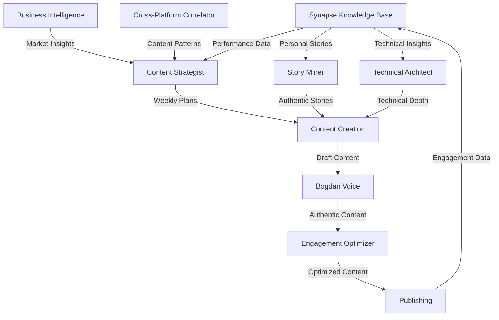

# Synapse Content Intelligence System
## Complete Integration of Sub-Agents, Knowledge Base, and Content Strategy

This document demonstrates how to leverage your Synapse Graph-Enhanced RAG system with specialized sub-agents to create a sophisticated content production ecosystem that systematically builds authority and generates business opportunities.

---

## 🎯 System Architecture Overview



---

## 🔄 Integrated Workflow: Synapse + Sub-Agents

### **Phase 1: Intelligence Gathering (Powered by Synapse)**

```bash
# Weekly intelligence analysis using Synapse
claude

# Query historical performance
> Query Synapse for top 10 performing LinkedIn posts in the last 90 days with engagement metrics

# Extract successful patterns
> Use Synapse's CrossPlatformCorrelator to identify content patterns that drove business inquiries

# Analyze audience evolution
> Show me audience growth patterns and demographic shifts from Synapse analytics

# Mine untapped stories
> Use Synapse to find personal experiences I haven't used in content yet

# Competitive intelligence
> Query Synapse for industry content trends and gaps we can fill
```

### **Phase 2: Strategic Planning (Content Strategist + Synapse)**

```bash
# Enhanced planning with real data
> Use content-strategist to create next week's content plan based on these Synapse insights: [paste intelligence gathered]

# Validate against historical performance
> Cross-reference the proposed topics with Synapse data on similar content performance

# Identify optimal story matches
> Use story-miner to query Synapse for relevant personal experiences for each planned topic
```

### **Phase 3: Content Creation (Multi-Agent + Synapse)**

```bash
# Example: Creating Tuesday's Technical Deep Dive

# Step 1: Historical context
> Query Synapse for previous posts about microservices vs monoliths and their performance

# Step 2: Technical framework
> Use technical-architect to create a controversial take on modular monoliths, incorporating insights from Synapse about what resonated before

# Step 3: Personal story integration
> Use story-miner to find specific examples from my fintech scaling experience related to this architecture decision

# Step 4: Voice optimization
> Use bogdan-voice to ensure this matches my authentic style, referencing successful patterns from Synapse

# Step 5: Engagement optimization
> Use engagement-optimizer to enhance based on Synapse's analysis of high-performing technical debates
```

---

## 📊 Synapse-Powered Content Intelligence Queries

### **Performance Analysis Queries**

```bash
# Top performing content patterns
> Synapse query: "Show me all LinkedIn posts with >10% engagement rate grouped by content type"

# Business development correlation
> Synapse analyze: "Which content topics generated the most consultation inquiries in Q4"

# Audience intelligence
> Synapse query: "Extract audience pain points from comments on my top 20 posts"

# Competitive gaps
> Synapse analyze: "Compare my content topics with industry leaders and identify uncovered areas"
```

### **Story Mining Queries**

```bash
# Untold experiences
> Synapse search: "Find all personal experiences mentioned in documents but not used in LinkedIn content"

# Success metrics extraction
> Synapse query: "Extract all quantifiable outcomes from my project experiences (cost savings, performance improvements)"

# Failure stories
> Synapse search: "Find learning moments and failures that demonstrate vulnerability and growth"

# Technical decisions
> Synapse analyze: "List all architecture decisions I've made with their business outcomes"
```

### **Optimization Intelligence**

```bash
# Engagement pattern analysis
> Synapse analyze: "What content elements correlate with high engagement (questions, metrics, controversy)"

# Timing optimization
> Synapse query: "Show engagement rates by day of week and time of day for technical content"

# CTA effectiveness
> Synapse analyze: "Which call-to-action patterns generated the most business inquiries"

# Hashtag performance
> Synapse query: "Analyze hashtag usage and correlation with reach and engagement"
```

---

## 🚀 Advanced Integration Patterns

### **1. Predictive Content Planning**

```bash
# Use Synapse's ViralPredictionEngine with content planning
> Use Synapse's viral prediction model to score these 5 content ideas for next week

# Adjust based on predictions
> Use content-strategist to revise the weekly plan prioritizing high-prediction-score topics

# A/B test preparation
> Generate 3 headline variations for the highest-scoring topic using engagement patterns
```

### **2. Real-Time Optimization Loop**

```bash
# Monday morning check
> Synapse analyze: "How is today's post performing compared to similar Monday posts?"

# Mid-week adjustment
> Based on Monday-Tuesday performance, should we adjust Wednesday's planned topic?

# Friday retrospective
> Use Synapse to analyze this week's content performance and identify improvement areas
```

### **3. Cross-Platform Content Correlation**

```bash
# Content recycling intelligence
> Use CrossPlatformCorrelator to identify high-performing content suitable for other platforms

# Platform-specific optimization
> How should I adapt this LinkedIn post for Twitter while maintaining impact?

# Content evolution tracking
> Show me how this core idea evolved from Notion note to LinkedIn post to blog article
```

---

## 💡 Synapse-Enhanced Sub-Agent Prompts

### **Enhanced Content Strategist**

```bash
# Add Synapse intelligence to planning
> Use content-strategist to plan next week, but first query Synapse for:
  - Top 5 performing topics in the last quarter
  - Audience questions that remain unanswered
  - Competitive content gaps in our space
  - Upcoming industry events or trends
```

### **Data-Driven Story Miner**

```bash
# Story selection with performance data
> Use story-miner to find a scaling story, but choose one that aligns with topics that generated >8% engagement according to Synapse
```

### **Technical Architect with Trends**

```bash
# Trend-aware technical content
> Use technical-architect to create content about FastAPI, incorporating Synapse insights about what FastAPI questions our audience asks most
```

---

## 📈 Continuous Improvement Cycle

### **Weekly Performance Review**

```bash
# Automated weekly analysis
Every Saturday at 2 PM:

> Generate comprehensive weekly content performance report:
  1. Engagement metrics vs. targets
  2. Business inquiry correlation
  3. Audience growth in target segments
  4. Content type performance ranking
  5. Story effectiveness analysis
  6. Optimization recommendations for next week
```

### **Monthly Intelligence Update**

```bash
# Monthly strategic analysis
First Sunday of each month:

> Run comprehensive Synapse analysis:
  1. Content ROI calculation
  2. Audience evolution and migration patterns
  3. Competitive landscape shifts
  4. Emerging topic opportunities
  5. Story inventory refresh
  6. Sub-agent prompt optimization based on performance
```

### **Quarterly Strategy Evolution**

```bash
# Quarterly deep dive
> Generate Q1 content strategy performance report:
  1. Business pipeline generated from content
  2. Authority metrics improvement
  3. Network growth in decision-maker segments
  4. Content-to-consultation conversion rates
  5. Story performance by category
  6. Sub-agent effectiveness metrics
  7. Q2 strategy recommendations
```

---

## 🎯 Business Intelligence Integration

### **Pipeline Tracking**

```bash
# Content-to-business correlation
> Synapse analyze: "Track correlation between content topics and consultation inquiry topics"

# ROI calculation
> Calculate content ROI: [Time invested] vs [Pipeline generated] for each content type

# Decision-maker engagement
> Identify which content resonates most with C-level executives vs technical practitioners
```

### **Strategic Positioning**

```bash
# Authority building measurement
> Track mentions of my name with "fractional CTO" or "technical leadership" over time

# Thought leadership indicators
> Analyze reshares and quotes by industry influencers

# Speaking opportunity correlation
> Which content topics generated speaking invitations?
```

---

## 🔧 System Maintenance & Optimization

### **Sub-Agent Performance Tuning**

```bash
# Monthly agent effectiveness review
> Analyze which sub-agents consistently produce high-performing content

# Prompt refinement
> Based on Synapse data, update bogdan-voice agent with new successful patterns

# Story database refresh
> Update story-miner with new experiences and their performance metrics
```

### **Knowledge Base Enrichment**

```bash
# Weekly knowledge update
> Add this week's content performance data to Synapse for future analysis

# Story performance tagging
> Tag personal stories in Synapse with engagement metrics for better selection

# Competitive intelligence refresh
> Update Synapse with new industry content trends and competitor strategies
```

---

## 🚨 Troubleshooting Integration Issues

### **Common Patterns & Solutions**

```bash
# Pattern: Declining engagement
> Synapse diagnose: "Analyze content fatigue patterns - am I repeating themes too often?"
> Solution: Use story-miner to find fresh angles on proven topics

# Pattern: Low business inquiry conversion
> Synapse analyze: "Which content generates engagement but not business inquiries?"
> Solution: Adjust CTAs based on high-converting content patterns

# Pattern: Time management challenges
> Synapse optimize: "Which content types provide best ROI for time invested?"
> Solution: Focus on high-ROI formats, batch similar content
```

---

## 🎪 Advanced Use Cases

### **Campaign-Driven Content**

```bash
# Product launch campaign
> Design 10-day content campaign for new service launch:
  - Use Synapse to identify audience readiness indicators
  - Create escalating value content series
  - Include strategic story placement
  - Optimize each piece for viral potential
```

### **Event-Driven Authority Building**

```bash
# Conference speaking preparation
> Create pre-conference content strategy:
  - Topics that position expertise
  - Stories that humanize technical leadership
  - Debate-starting content for visibility
  - Network expansion optimization
```

### **Crisis Response Content**

```bash
# Industry controversy response
> Craft thoughtful response to industry issue:
  - Query Synapse for relevant past positions
  - Ensure consistency with established beliefs
  - Add unique perspective from experience
  - Optimize for thought leadership, not virality
```

---

## 📊 Success Metrics Dashboard

### **Real-Time Monitoring**

```python
# Weekly dashboard metrics
content_metrics = {
    "engagement": {
        "target": "8-12%",
        "actual": synapse.query("average_engagement_this_week"),
        "trend": "↑"
    },
    "business_development": {
        "inquiries": synapse.query("consultation_inquiries_this_week"),
        "pipeline_value": synapse.query("pipeline_value_from_content"),
        "conversion_rate": "12%"
    },
    "audience_growth": {
        "total_followers": synapse.query("linkedin_followers"),
        "decision_makers": synapse.query("c_level_follower_percentage"),
        "engagement_quality": synapse.query("comment_quality_score")
    },
    "content_efficiency": {
        "time_per_piece": "45 minutes",
        "roi_per_hour": "$1,250",
        "automation_savings": "60%"
    }
}
```

---

## 🎯 Implementation Roadmap

### **Week 1: Foundation**
- Set up all sub-agents
- Connect Synapse queries
- Create first week's content
- Establish baseline metrics

### **Week 2-4: Optimization**
- Refine agent prompts based on performance
- Optimize Synapse queries
- Improve content-to-business correlation
- Scale successful patterns

### **Month 2-3: Intelligence Enhancement**
- Build comprehensive story database
- Create performance prediction models
- Develop advanced content templates
- Automate routine analyses

### **Quarter 2+: Scale & Sophistication**
- Multi-platform content orchestration
- Predictive content planning
- Automated optimization loops
- Strategic advisory positioning

---

This integrated system transforms content creation from art to science, leveraging your Synapse intelligence platform and specialized sub-agents to systematically build authority while generating predictable business outcomes. The key is maintaining authentic voice while using data-driven optimization for maximum impact.